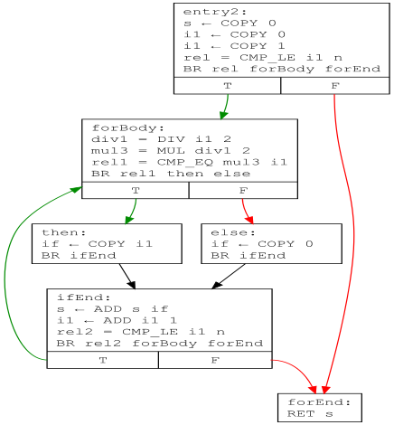

# Optimizări 1 - Cod intermediar. Numerotarea valorilor

## Cod intermediar

În cadrul unui compilator, se ridică problema alegerii unei **reprezentări intermediare** a codului sursă, care să înlesnească aplicarea optimizărilor. Soluția adoptată pe scară largă vizează așa-zisul **cod intermediar**, care este o formă de reprezentare intermediară, internă compilatorului, la fel ca AST-ul (deși mai există și alte forme, precum graful de dependență a instrucțiunilor sau graful de apel al funcțiilor). Noi vom utiliza o anumită specie de cod intermediar, numită ***three-adress code***, întrucât majoritatea instrucțiunilor referă maximum trei entități (rezultat și operanzi). Un de exemplu de instrucțiune este `b = ADD a 2`. Acest format este similar celui utilizat în cadrul proiectului [LLVM](https://mcyoung.xyz/2023/08/01/llvm-ir/).

**Avantajele** utilizării unui astfel de cod intermediar sunt următoarele:

* Pe de o parte, este de **nivel mai scăzut** decât AST-ul, expunând **mai multe oportunități** de rescriere. De exemplu, faptul că două instrucțiuni consecutive de cod sursă generează operații redundante cu registre la granița dintre secvențele aferente (cum ar fi scrierea într-un registru la finalul secvenței generate pentru prima instrucțiune și citirea din același registru la începutul secvenței generate pentru a doua instrucțiune) cel mai probabil nu va fi observabil la nivelul AST-ului.
* Pe de altă parte, este de **nivel mai înalt** decât limbajele de asamblare corespunzătoare arhitecturilor fizice, permițând **reutilizarea** majorității optimizărilor.

Instrucțiunile de cod intermediar sunt organizate în ***basic blocks***, care reprezintă secvențe liniare de instrucțiuni, executate întotdeauna **în ordine**. Aceasta însemnă că **definițiile etichetelor** pot apărea numai la începutul unui bloc, iar **salturile**, numai la sfârșit. La rândul lor, blocurile sunt organizate în **grafuri ale fluxului de control** (*control-flow graphs*, CFG), în care **nodurile** sunt blocuri, iar **arcele** (orientate) desemnează posibilitatea transferului fluxului de control între blocuri.

CFG-urile sunt utilizate pentru a descrie **corpurile funcțiilor**. De exemplu, pentru funcția CPLang de mai jos,

```c++
Int complex(Int n) {
    Int s = 0;
    Int i;

    for i = 1, i <= n, i = i + 1 do
        s = s + if i / 2 * 2 == i then i else 0 fi;

    s;
};
```

CFG-ul este următorul:



În cadrul **scheletului** de laborator, reprezentarea și construcția codului intermediar se află în pachetul `irgen`:

* Clasa `Instruction` desemnează o **instrucțiune** de cod intermediar, caracterizată de tipul, rezultatul și operanzii săi.
* Enumerarea `InstructionType` surprinde **tipurile** posibile ale instrucțiunilor.
* Clasa `BasicBlock` reprezintă un **bloc**, caracterizat de eticheta de început, lista de instrucțiuni și listele de blocuri succesor și predecesor din cadrul CFG-ului căruia îi aparține acest bloc.
* Clasa `CFG` descrie un **graf al flxului de control**, prin lista blocurilor și blocul curent la care se adaugă noi instrucțiuni. Clasa expune o metodă de afișare a grafului în **format DOT**, pe care îl puteți vizualiza cu [plug-in-ul de IntelliJ](https://plugins.jetbrains.com/plugin/10312-dot-language).
* Clasa `IRGenVisitor` construiește pentru un program CPLang:
  * CFG-ul **corpului principal** în fișierul `main.dot`
  * CFG-ul **fiecărei funcții** în fișierele `<nume-funcție>.dot`.

În plus, câteva clase din pachetul `semantic` au fost îmbogățite:

* `IdSymbol` conține acum un mecanism de gestiune a versiunilor numelor simbolurilor, pentru afișarea mai expresivă a codului intermediar.
* `FunctionSymbol` are acum o referință către CFG-ul său.
* A fost adăugată clasa `IntSymbol`, pentru reprezentarea facilă a operanzilor literal întreg în instrucțiunile de cod intermediar.

Găsiți explicații detaliate în comentariile claselor.

## Optimizări locale

Optimizările **locale** operează la nivelul unui **singur *basic block***. La curs, au fost prezentate mai multe astfel de optimizări:

* ***Algebraic simplification***: rescrierea unor forme algebrice speciale. De exemplu, instrucțiunea de mai jos poate fi rescrisă astfel:

  ```
  b = ADD 0 a  |  b = COPY a
  ```

* ***Constant folding***: precalcularea unor expresii la compilare. De exemplu, instrucțiunea de mai jos poate fi rescrisă astfel:

  ```
  b = ADD 1 2  |  b = COPY 3
  ```

* ***Copy/constant propagation***: propagarea constantelor sau copiilor în alte instrucțiuni. De exemplu, ultima instrucțiune din secvența de mai jos poate fi rescrisă astfel:

  ```
  b = COPY a
  c = COPY 2
  d = ADD b c  |  d = ADD a 2
  ```

* ***Common subexpression elimination***: reutilizarea rezultatului deja calculat al unei expresii. De exemplu, ultima instrucțiune din secvența de mai jos poate fi rescrisă astfel:

  ```
  d = ADD b c
  e = ADD b c  |  e = COPY d
  ```

  În mod clar, această optimizare nu poate fi aplicată decât dacă rezultatul și toți operanzii expresiei deja calculate **NU sunt redefiniți** până la rescrierea altei instrucțiuni.

Aceste optimizări pot **interacționa** masiv, în cascadă, fiecare optimizare putând înlesni la rândul ei alte optimizări. De exemplu, deși în secvența de mai jos, nu se poate aplica direct *common subexpression elimination*, aceasta devine posibilă după o rundă de *copy propagation*:

```
  a = b
  d = ADD b c
  e = ADD a c  |  e = ADD b c  |  e = COPY d
```

## Numerotarea valorilor

**Toate optimizările** de mai sus, împreună cu câteva extensii, pot fi implementate într-o **singură trecere** peste un *basic block*, utilizând strategia de **numerotare a valorilor** (***value numbering***). Pentru simplitate, vom presupune că toate variabilele sunt **definite o singură dată**, încât să putem aplica în siguranță optimizările de mai sus. În cazul general, când codul intermediar nu satisface această condiție a definirilor unice, se poate aplica un algoritm de transformare într-o astfel de formă (*static single-assignment form*, SSA), discutat la curs.

Strategia de numerotare a valorilor urmărește gruparea expresiilor din bloc pe baza criteriului **identității de valoare**. Deși doar pentru o parte dintre expresii putem cunoaște de la compilare valoarea concretă (de exemplu, `5`), în urma analizei putem determina expresiile care calculează întotdeauna aceeași valoare pentru toate execuțiile posibile ale blocului, **chiar dacă** aceasta este necunoscută la compilare. Prin urmare, vom folosi termenul de *valoare* într-o accepție abstractă, întrucât e posibil să nu o cunoaștem de fapt.

Strategia utilizează un tabel cu **câte o intrare** pentru fiecare expresie din bloc, și cu **trei coloane**:

* **Numărul valorii** (*value number*). Toate expresiile care calculează aceeași valoare vor avea același număr asociat.
* **Cheia de căutare**, care descrie o expresie din bloc. Este singura coloană cu **intrări unice**.
* **Reprezentarea canonică**. Dacă expresia a fost deja calculată, conține **rezultatul** acesteia, care poate fi o **constantă**, dacă valoarea concretă este cunoscută, sau o **variabilă**, dacă valoarea concretă nu este cunoscută.

Să vedem cum decurge completarea tabelului și rescrierea instrucțiunilor pentru blocul de mai jos:

```
b = COPY a
c = COPY 2
d = COPY b
e = ADD a 2
f = ADD d 2
g = ADD c c
```

* La întâlnirea instrucțiunii `b = COPY a`, primul lucru este căutarea operanzilor în tabel. Cum tabelul este gol, se creează o intrare pentru `a` în forma `<0, a, a>`. Numărul valorii este `0`, cheia de căutare este `a`, iar reprezentarea canonică este tot `a`. Apoi se creează o intrare pentru rezultatul `b`, care capătă același număr de valoare și aceeași reprezentare canonică de la `a`. A doua intrare este `<0, b, a>`. În acest moment, tabelul este:

  |#|Cheie|Canonic|
  |-|-----|-------|
  |0|a|a|
  |0|b|a|

* La întâlnirea instrucțiunii `c = COPY 2`, se realizează o prelucrare similară, de data aceasta adăugându-se intrări pentru literalul `2` și pentru rezultatul `c`. Tabelul devine:

  |#|Cheie|Canonic|
  |-|-----|-------|
  |0|a|a|
  |0|b|a|
  |1|2|2|
  |1|c|2|

* La întâlnirea instrucțiunii `d = COPY b`, se determină mai întâi intrarea existentă din tabel pentru operandul `b`. În continuare, se adaugă intrarea pentru rezultatul `d`, care preia numărul valorii și reprezentarea canonică de la operandul `b`. Tabelul devine:

  |#|Cheie|Canonic|
  |-|-----|-------|
  |0|a|a|
  |0|b|a|
  |1|2|2|
  |1|c|2|
  |0|d|a|

  În plus, putem acum realiza ***copy propagation*** și rescrie instrucțiunea în varianta `d = COPY a`, unde pe `a` l-am obținut din **reprezentarea canonică** a lui `b`.

* La întâlnirea instrucțiunii `e = ADD a 2`, se determină mai întâi intrările existente din tabel pentru operanzi: variabila `a` și literalul `2`. În continuare, se pune problema construirii cheii expresiei `ADD a 2`. În locul acestei expresii înseși putem utiliza o cheie mai flexibilă, de forma `ADD #0 #1`, unde utilizăm **numerele valorilor** operanzilor în locul operanzilor înșiși. Introducem o intrare și pentru rezultatul `e`, și ambele intrări capătă un nou număr de valoare, `2`, și reprezentarea canonică `e`. Tabelul devine:

  |#|Cheie|Canonic|
  |-|-----|-------|
  |0|a|a|
  |0|b|a|
  |1|2|2|
  |1|c|2|
  |0|d|a|
  |2|ADD #0 #1|e|
  |2|e|e|

* La întâlnirea instrucțiunii `f = ADD d 2`, se determină mai întâi intrările existente din tabel pentru operanzi: variabila `d` și literalul `2`. În continuare, se vede utilitatea cheilor extinse introduse la punctul anterior. Dacă utilizam acum cheia `ADD d 2`, nu am fi recunoscut cheia introdusă în prealabil, `ADD a 2`. În schimb, utilizând cheia extinsă, `ADD #0 #1`, recunoaștem expresia ca fiind deja calculată, **în ciuda** diferențelor textuale. Tabelul devine:

  |#|Cheie|Canonic|
  |-|-----|-------|
  |0|a|a|
  |0|b|a|
  |1|2|2|
  |1|c|2|
  |0|d|a|
  |2|ADD #0 #1|e|
  |2|e|e|
  |2|f|e|

  În plus, putem aplica ***common subexpression elimination*** și rescrie instrucțiunea în forma `f = COPY e`.

* Dacă în instrucțiunea de mai sus, întâlneam operanzii inversați, `f = ADD 2 d`, cheia de căutare ar fi fost `ADD #1 #0`, diferită de cea din tabel. Prin urmare, doar pentru operațiile **comutative**, putem **sorta crescător** numerele valorilor, pentru a obține cheia `ADD #0 #1`, din tabel.

* La întâlnirea instrucțiunii `g = ADD c c`, se determină mai întâi intrările existente din tabel pentru operanzi: variabila `c`. De data aceasta, reprezentarea canonică a lui `c` este o constantă, și putem aplica ***constant folding***. Prin urmare, se introduc intrări pentru rezultatul 4, precalculat, și pentru rezultatul `g`. Tabelul devine:

  |#|Cheie|Canonic|
  |-|-----|-------|
  |0|a|a|
  |0|b|a|
  |1|2|2|
  |1|c|2|
  |0|d|a|
  |2|ADD #0 #1|e|
  |2|e|e|
  |2|f|e|
  |3|4|4|
  |3|g|4|

  În plus, putem rescrie instrucțiunea în forma `g = COPY 4`.

* Similar pot fi tratate și **simplificările algebrice**.

## Cerințe

1. Vizualizați CFG-urile funcțiilor ``simple`` și ``complex`` din fișierul ``value-numbering.txt``.
1. Implementați strategia de **numerotare a valorilor**, completând porțiunile `TODO` din clasa `ValueNumbering` din pachetul `optim`. Blocul pe care îl veți optimiza este corpul funcției `simple`. O posibilă ieșire este în fișierul `output.txt`.