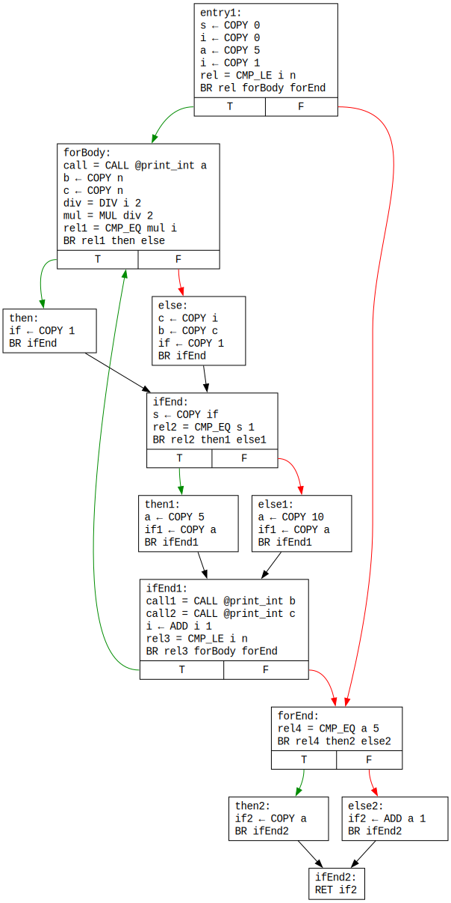
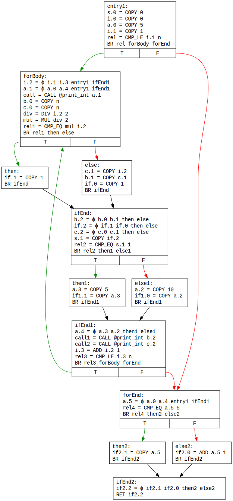
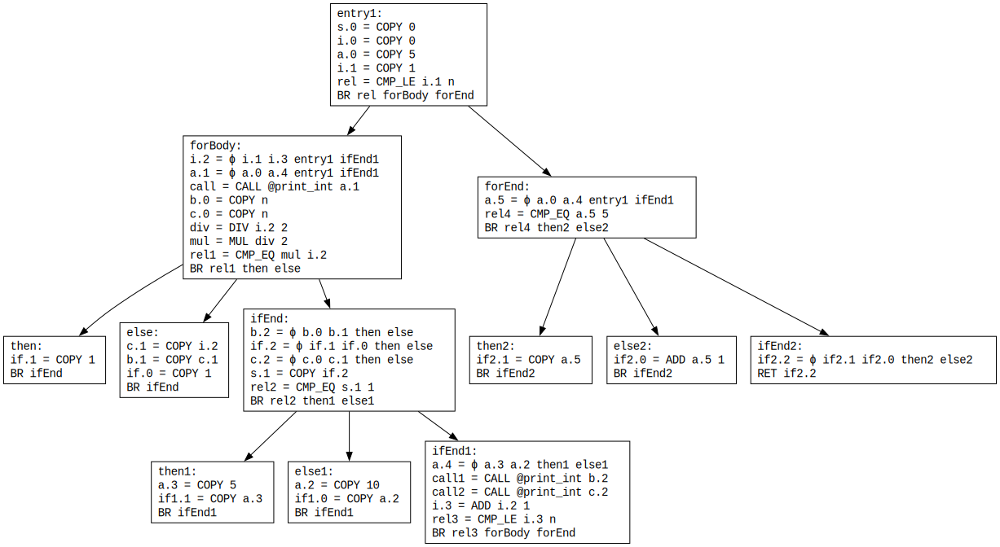
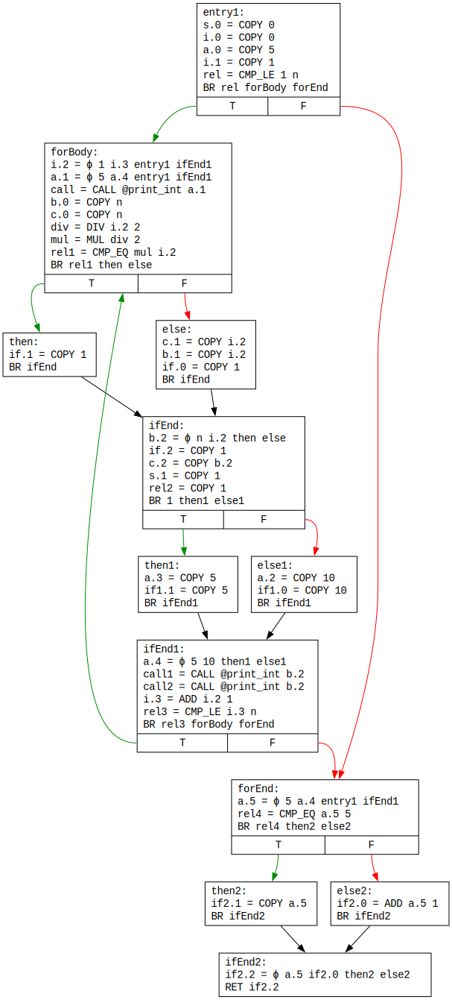
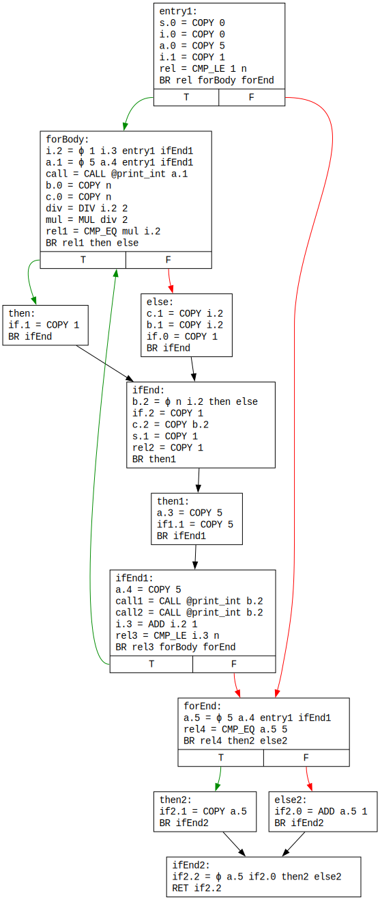
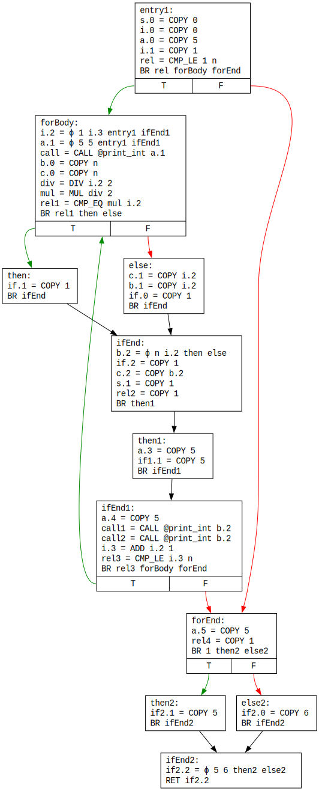
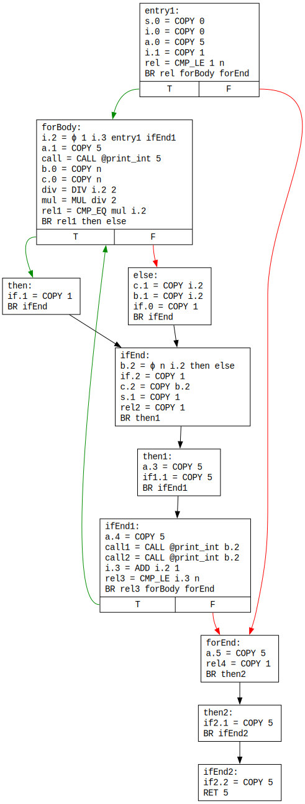

# Optimizări 2 - Numerotarea globală a valorilor. Eliminarea codului neexecutabil

## Optimizări globale

Spre deosebire de optimizările **locale**, discutate în laboratorul anterior, care operează la nivelul unui **singur bloc**, optimizările **globale** operează la nivelul unui **întreg graf al fluxului de control** (CFG). Optimizările globale se mai disting de cele locale prin faptul că:

* Necesită de obicei etape distincte de **analiză** și **transformare** (rescrierea codului nu se poate face întotdeauna din prima, fiind necesară acumularea prealabilă de informație din CFG).
* Fiecare etapă poate necesita la rândul său **mai multe treceri** peste CFG (din cauza ciclurilor).

La curs au fost prezentate mai multe **analize globale**, care se pot împărți în:

* Analize ***top-down***/***forward***, realizate în sensul arcelor: analiza globală a constantelor, analiza de dominanță.
* Analize ***bottom-up***/***backwards***, realizate în sensul invers al arcelor: analiza duratei de viață a valorilor (*liveness*).

## Forma SSA

De obicei, generarea inițială a codului intermediar produce **redefiniri** de variabile, care **complică** diversele analize globale. Prin urmare, a fost dezvoltat un algoritm de transformare a codului intermediar în forma cu atribuiri unice (***static single-assignment form***, SSA), discutată pe larg la curs, și care constituie reprezentarea standard în compilatoarele moderne. În cadrul acesteia:

* Fiecare variabilă este **definită o singură dată**, obținând un efect de **identificare** a instrucțiunii de definire cu variabila pe care o introduce.
* Fiecare referire la o variabilă poate fi pusă în corespondență cu o **definiție unică**.

În esență, forma SSA **combină** informații despre:

* Fluxul de **control**, surprins de tiparele arcelor din CFG
* Fluxul de **date**, surprins de tiparele de utilizare a variabilelor.

Aceasta reprezentare poate simplifica semnificativ prelucrările.

Transformarea în forma SSA presupune **redenumirea** variabilelor, în scopul obținerii de definiții unice. Astfel, aceeași variabilă din codul intermediar original poate căpăta diferite **versiuni**. De exemplu, definițiile lui `a` devin `a.0`, `a.1` etc. Redenumirea se poate realiza banal la nivelul unui singur bloc. Problema apare dacă, la intrarea într-un bloc, sunt vizibile **multiple versiuni** ale aceleiași variabile originale; care versiune ar trebui folosită în blocul respectiv? Pentru aceasta, forma SSA introduce **instrucțiunea specială ϕ**, care agregă versiunile vizibile sub o nouă versiune.

Să luăm următoarea funcție CPLang:

```c++
Int f(Int n) {
    Int s = 0;
    Int i;
    Int a = 5;

    for i = 1, i <= n, i = i + 1 do {
        print_int(a);

        Int b = n;
        Int c = n;

        s = if i / 2 * 2 == i then 1 else { b = c = i; 1; } fi;

        if s == 1 then a = 5 else a = 10 fi;

        print_int(b);
        print_int(c);
    };

    if a == 5 then a else a + 1 fi;
};
```

CFG-ul generat inițial arată astfel:



Se observă următoarele:

* Majoritatea variabilelor au **multiple definiții** (de exemplu, `s`, `i`, `if`, `if1` etc.). Pentru acestea, se utilizează instrucțiuni **distructive**, simbolizate prin caracterul `←`.
* Unele variabile au **definiții unice** (de exemplu, `rel`, `div` etc.). Pentru acestea, se utilizează instrucțiuni **pure**, simbolizate prin caracterul `=`.

Rezultatul transformării în forma **SSA** este următorul:



Se observă următoarele:

* Toate instrucțiunile au devenit **pure**.
* Definițiile multiple ale aceleiași variabile au primit **versiuni** diferite.
* La începutul blocurilor în care sunt vizibile **multiple versiuni** ale unor variabile ***live*** la intrarea în acele blocuri, au fost introduse **instrucțiuni ϕ**. De exemplu, la începutul blocului `ifEnd`, fiind vizibile versiunile `b.0` și `b.1` ale variabilei `b`, a fost introdusă instrucțiunea `b.2 = ϕ b.0 b.1 then else`, cu semnificația:
  * Dacă fluxul de control vine din blocul `then`, atunci `b.2` preia valoarea lui `b.0`. Observați că **definiția lui `b.0` nu este în blocul `then`, ci în blocul `forBody`**!
  * Dacă fluxul de control vine din blocul `else`, atunci `b.2` preia valoarea lui `b.1`.

## Numerotarea globală a valorilor

Cum ar putea fi **extinsă** numerotarea locală a valorilor din laboratorul anterior pe întregul CFG? De exemplu, pe căile `entry1 - forBody - then` și `entry1 - forBody - else`, aplicarea strategiei de numerotare a valorilor poate decurge fără probleme, continuând popularea tabelului valorilor la **intrarea** într-un nou bloc. De remarcat că, la intrarea în blocul `else`, tabelul valorilor este cel de la finalul căii `entry1 - forBody`, **neconținând** informație despre blocul `then`. De la ce informație ar trebui să plece prelucrarea blocului `ifEnd`?

Mai precis trebuie să răspundem la două întrebări:

1. Care este **cel mai recent bloc strămoș** de la finalul căruia putem continua popularea tabelului în `ifEnd`?
1. Cum încorporăm informația din **blocurile laterale**, `then` și `else`?

Din principiul de construcție a formei SSA, o variabilă este vizibilă într-un bloc, dacă:

* Este definită într-un bloc care **domină** blocul curent SAU
* Este introdusă printr-o **instrucțiune ϕ** la începutul acelui bloc.

Amintim că un bloc `D` **domină** un bloc `B` dacă toate căile de la blocul de intrare la `B` trec prin `D`. **Prezența unei instrucțiuni ϕ codifică implicit redefinirea unei variabile într-un bloc lateral, care nu domină blocul curent!** Prin urmare, răspundem la cele două întrebări astfel:

1. Blocul de la finalul căruia pornește popularea tabelului lui `ifEnd` este **dominatorul său imediat**, `forBody`.
1. Contabilizarea interferențelor produse de blocurile `then` și `else` se realizează prin actualizarea operanzilor **instrucțiunilor ϕ** de la începutul lui `ifEnd`.

Pentru prelucrarea întregului CFG în ordinea dată de relațiile de **dominare**, se utilizează **arborele de dominare**, valorificat și în timpul transformării propriu-zise în forma SSA. Părintele unui nod în acest arbore este **dominatorul său imediat**. Arborele de dominare pentru graful din exemplu este următorul:



Mai precis, numerotarea globală a valorilor decurge conform unei parcurgeri în **preordine** a **arborelui de dominanță**. Aspectele importante sunt următoarele:

1. La intrarea într-un bloc, se **salvează starea curentă a tabelului**, pentru a putea reveni la aceasta la încheierea parcurgerii subarborelui de dominanță înrădăcinat în blocul curent. De exemplu, după încheierea parcurgerii subarborelui cu rădăcina `forBody`, se revine la starea tabelului de la finalul lui `entry1` pentru începerea parcurgerii subarborelui cu rădăcina `forEnd`.
1. Se completează tabelul și se rescrie blocul curent, conform strategiei de numerotare a valorilor din laboratorul anterior, îmbogățită cu tratamentul **instrucțiunilor ϕ**:

    * O instrucțiune ϕ cu **toți operanzii identici** poate fi înlocuită cu una de copiere. De exemplu, instrucțiunea următoare poate fi rescrisă:

        ```
        y = ϕ x x bloc0 bloc1  |  y = COPY x
        ```

    * Pot exista instrucțiuni ϕ **redundante**, în sensul eliminării subexpresiilor comune. De exemplu, secvența următoare poate fi rescrisă:

       ```
       u = ϕ x y bloc0 bloc1
       v = ϕ x y bloc0 bloc1  |  v = COPY u
       ```

1. Se populează operanzii instrucțiunilor ϕ din **succesorii din CFG** ai blocului curent (nu din arborele de dominanță!). De exemplu, după procesarea blocului `forBody`, se populează operanzii instrucțiunilor ϕ din `then` și `else` (nu și din `ifEnd`).
1. Se continuă procesarea recursivă a **copiilor din arborele de dominanță**. Pentru blocul `forBody`, copiii sunt `then`, `else` și `ifEnd`. Având în vedere că este util ca `then` și `else` să fie prelucrați înaintea lui `ifEnd`, se optează pentru o parcurgere a copiilor în ordinea dată de o parcurgere a CFG-ului în **post-ordine inversă** (*reverse post-order*).
1. Se **reface starea tabelului** de la intrarea în blocul curent.

Detaliile implementării se găsesc în schelet.

Să vedem cum decurge o iterație pentru numerotarea globală a valorilor pe CFG-ul din exemplu:



Se observă următoarele:

* Valoarea 1 a variabilelor `if.0` și `if.1` a fost **propagată** în instrucțiunea `if.2 = ϕ if.1 if.0 then else` din `ifEnd`, care a devenit `if.2 = COPY 1`.
* Aceasta a fost **propagată** mai departe în definițiile lui `s.1` și `rel2`.
* În final, **condiția saltului** de la finalul lui `ifEnd` a devenit **constantă** (`1`/adevărată).
* Valorile `5`, respectiv `10`, ale lui `a.3` și `a.2` au fost **propagate** în instrucțiunea `a.4 = ϕ 5 10 then1 else1` de la începutul lui `ifEnd1`.
* Instrucțiunea ϕ pentru `c.2` din `ifEnd` a fost identificată drept **redundantă** și înlocuită cu `c.2 = COPY b.2`.

Să observăm, totuși, că odată ce condiția saltului de la sfârșitul lui `ifEnd` a devenit adevărată, calea care începe cu `else1` a devenit **neexcutabilă** (*unreachable*). **Prin urmare, valoarea `10` pentru `a.4` a devenit imposibil de obținut, și `a.4` ar trebui să devină constanta `5`.**

## Eliminarea codului neexecutabil

Eliminând codul neexecutabil, este posibil să înlesnim **propagarea suplimentară** a unor copii/constante. Aceasta, la rândul său, ar putea permite identificarea unor noi căi neexecutabile ș.a.m.d., într-o manieră **ciclică**.

Din CFG-ul din exemplu poate fi **înlăturat blocul `else1`** (neexecutabil), iar saltul condiționat de la sfârșitul lui `ifEnd` poate fi înlocuit cu unul **necondiționat** către `then1`, obținând:



În plus, în urma eliminării predecesorului `else1`, instrucțiunea `a.4 = ϕ 5 10 then1 else1` de la începutul lui `ifEnd1` devine `a.4 = COPY 5`.

Aplicând încă o iterație de numerotare globală a valorilor, se obține:



Se observă următoarele:

* Valoarea lui `a.4` a fost **propagată** în instrucțiunea `a.5 = ϕ 5 a.4 entry1 ifEnd1`, care a devenit `a.5 = COPY 5`.
* Valoarea lui `a.5` a fost **propagată** mai departe până la finalul CFG-ului.
* **Condiția** saltului de la finalul lui `forEnd` a devenit și ea **constantă** (`1`/adevărată).
* Parametrii instrucțiunii `a.1 = ϕ 5 a.4 entry1 ifEnd1`, au fost populați corespunzător, devenind `a.1 = ϕ 5 5 entry1 ifEnd1`. Cu toate acestea, mai este necesară încă o iterație pentru transformarea instrucțiunii în `a.1 = COPY 5`.

Aplicând încă o rundă de numerotarea globală a valorilor, una de eliminare a codului neexecutabil pentru blocul `else2`, și una de numerotare, se obține varianta finală a CFG-ului:



Acesta conține încă instrucțiuni inutile, care ar putea fi eliminate (de exemplu, `if2.1 = COPY 5`), dar acestea vor fi discutate în laboratorul următor.

## Cerințe

1. Extindeți **numerotarea valorilor** dintr-un bloc cu tratamentul **instrucțiunilor ϕ**, completând metoda `process(BasicBlock)` din clasa `GlobalValueNumbering` din pachetul `optim`.
1. Implementați eliminarea codului neexcutabil, completând clasa `UnreachableCodeElimination` din pachetul `optim`.
1. **Rulați alternativ** runde ale celor două optimizări, reconstituind secvența de prelucrări din descrierea laboratorului.
