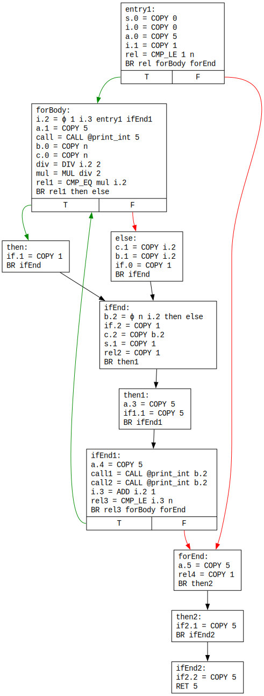
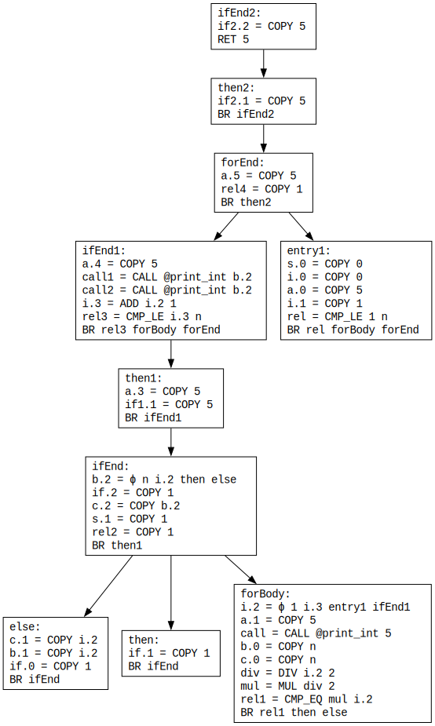
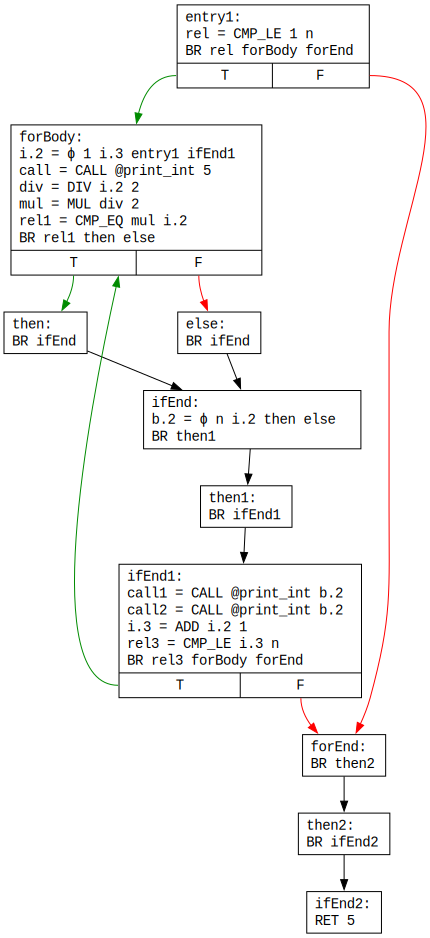
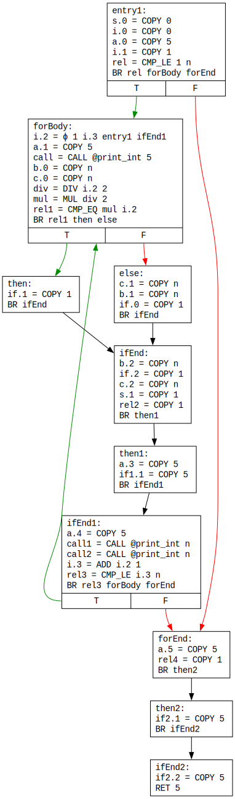
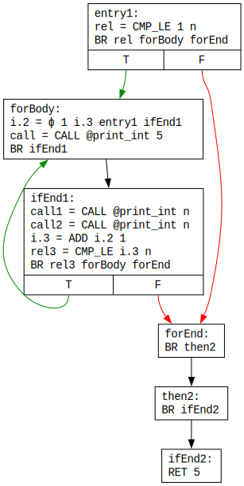
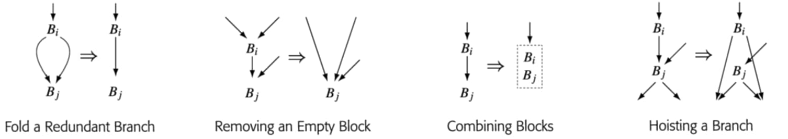
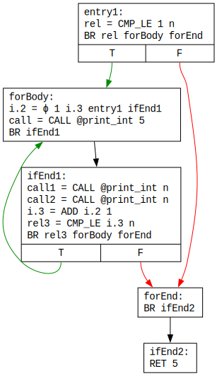
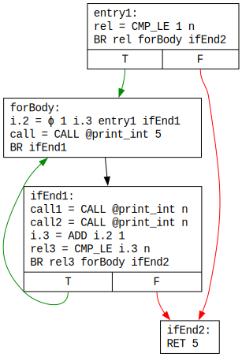
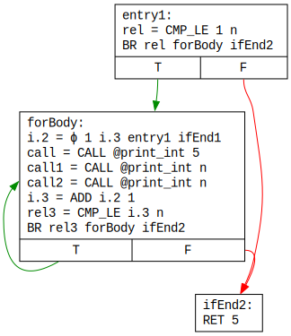

# Optimizări 3 - Eliminarea codului și a fluxului de control inutile

## Eliminarea codului inutil

Să ne amintim forma finală a CFG-ului din laboratorul anterior, după **multiple runde alternative** de **numerotare globală a valorilor** și de **eliminare a codului neexecutabil**:

Observăm că, după propagarea copiilor/constantelor, anumite instrucțiuni devin **inutile** (engl. *useless*), în sensul că, deși sunt executabile, ele nu contribuie la comportamentul programului. De exemplu, în blocul `ifEnd2`, odată ce valoarea `5` a lui `if2.2` a fost propagată în instrucțiunea `RET`, instrucțiunea sa de copiere nu mai este utilizată, și ar putea fi eliminată.

O instrucțiune poate fi considerată **utilă**  (engl. *useful*) dacă:

1. **Întoarce** o valoare din funcție (`RET`) sau **invocă** o altă funcție (`CALL`). Acestea se numesc instrucțiuni **critice**.
1. Rezultatul său este **utilizat** de altă instrucțiune utilă. De exemplu, dacă instrucțiunea `b = ADD a 1` a fost deja marcată ca utilă, atunci și instrucțiunea care îl definește pe `a` va fi considerată utilă.
1. Este de **salt condiționat**, dar execuția cel puțin a unei instrucțiuni utile **depinde** de existența sa.

Punctul (3) este mai subtil și necesită detaliere:

* Dacă o instrucțiune utilă se execută **independent** de ramura selectată, atunci, din perspectiva instrucțiunii, saltul condiționat este **inutil**, și ar putea fi înlocuit un unul necondiționat.
* În schimb, dacă execuția instrucțiunii utile **depinde** de ramura selectată (de exemplu, instrucțiunea este întâlnită pe o singură ramură, sau este o instrucțiune ϕ care selectează o valoare în funcție de blocul din care vine fluxul de control), atunci, din perspectiva instrucțiunii, saltul condiționat este **util**.

De exemplu, instrucțiunea `b.2 = ϕ n i.2 then else` din `ifEnd` selectează valoarea lui `b.2` în funcție de blocul din care provine fluxul de control. Prin urmare, instrucțiunile `BR ifEnd` de la finalul lui `then` și `else` devin utile, întrucât permit selecția valorii. Execuția acestora, **depinde**, la rândul său de **saltul condiționat** `BR rel1 then else` din `forBody`, care devine **util**.

Similar, dacă blocul `then` conținea el însuși instrucțiuni **critice** (de exemplu, `CALL`), saltul condiționat de mai sus devenea de asemenea util.

Presupunând că o instrucțiune a fost deja marcată ca utilă (de exemplu, `BR ifEnd` din `then`), cum ne dăm seama mai precis care este **saltul condiționat anterior** de care **depinde** execuția instrucțiunii utile (de exemplu, `BR rel1 then else` din `forBody`), în vederea marcării lui însuși ca util? În acest sens, introducem conceptual dual celui de dominanță din laboratorul trecut, și anume cel de **postdominanță**.

Un bloc `P` **postdomină** un bloc `B` dacă toate căile de la `B` la blocul de ieșire trec prin `P`. De exemplu, blocul `ifEnd` postdomină blocul `forBody`, dar blocul `then` nu postdomină blocul `forBody`, întrucât există calea prin `else` dinspre `forBody` spre blocul de ieșire, care nu trece prin `then`. Execuția unei instrucțiuni din blocul `then` **depinde** de saltul condiționat de la finalul blocului `forBody` tocmai pentru că **nu îl postdomină**, fiind de fapt primul bloc care iese din sfera de postdominanță a lui `then`; cu alte cuvinte, `forBody` este în **frontiera de postdominanță** a lui `then`.

Frontierele de postdominanță se determină utilizând **arborele de postdominanță**, care nu este altceva decât **arborele de dominanță** al **CFG-ului inversat** (cu arcele inversate). Arborele de postdominanță este reprezentat mai jos:

În concluzie, ori de câte ori întâlnim o instrucțiune utilă, trebuie:

1. Să marcăm drept utile instrucțiunile care definesc **operanzii** săi.
1. În cazul **instrucțiunilor ϕ**, să parcurgem **blocurile referite** de instrucțiune și să marcăm drept utile **salturile** de la finalul acestora.
1. Să parcurgem blocurile din **frontiera de postdominanță** a blocului care conține instrucțiunea și să marcăm drept utile **salturile condiționate** de la finalul acestor blocuri.

Pentru implementare, se utilizează o **coadă de instrucțiuni** ce urmează a fi procesate prin prisma **utilității**, care inițial conține instrucțiunile **critice**. Într-un pas, se elimină o instrucțiune, și se aplică pașii de mai sus, care pot introduce noi instrucțiuni utile în coadă.

În final, după ce toate instrucțiunile utile au fost identificate, este necesară **simplificarea** CFG-ului:

1. O instrucțiune **inutilă** care **nu este un salt** este **eliminată**. De exemplu, `if2.2 = COPY 5` din `ifEnd2` poate fi eliminată.
1. **Salturile necondiționate** sunt lăsate ca atare, **indiferent** de utilitatea lor. Ele vor putea fi simplificate de optimizarea din secțiunea de mai jos, Eliminarea fluxului de control inutil.
1. Un **salt condiționat inutil** nu conduce la executarea de instrucțiuni utile pe niciuna dintre ramurile sale, până la întâlnirea **primului postdominator care conține instrucțiuni utile**. Prin urmare, saltul poate fi **înlocuit cu unul necondiționat** către acest bloc.

Eliminând instrucțiunile inutile din CFG-ul nostru, obținem:

Din păcate, în exemplu, toate salturile condiționate sunt utile, și punctul (3) de mai sus nu a putut fi demonstrat. Astfel, pentru a evidenția și acest punct, să ne imaginăm o **variație** a codului original: înlocuim dubla atribuire `b = c = i` cu `b = c = n`, cu efect asupra blocului `else`. CFG-ul devine:

Instrucțiunea ϕ de mai sus devine mai întâi `b.2 = ϕ n n then else` și apoi `b.2 = COPY n`, urmare transformărilor din laboratorul trecut. Efectul este că **niciuna** dintre instrucțiunile din blocurile `then` și `else` nu mai este utilă, și, prin urmare, **nici saltul condiționat** `BR rel1 then else` din `forBody` nu mai este util. Prin urmare, saltul poate fi **înlocuit cu unul necondiționat** către **primul postdominator care conține instrucțiuni utile**, și anume `ifEnd1`. Aceasta face ca blocurile `then`, `else`, `ifEnd` și `then1` să devină neexecutabile. După eliminarea codului neexecutabil din laboratorul trecut, se obține CFG-ul:

Vom continua expunerea utilizând această variantă.

## Eliminarea fluxului de control inutil

Deși instrucțiunile de salt rămase nu sunt inutile per se (ele contribuie la obținerea comportamentului dorit), CFG-ul poate fi simplificat, aplicând unele dintre transformările de mai jos:

În diagrama de mai sus, prin **bloc gol** se înțelege un bloc care conține doar un salt (nu absența instrucțiunilor); este cazul blocurilor `forEnd`, `then2` și `ifEnd2`. Eliminarea unui bloc gol (*removing an empty block*) asumă că blocul `Bi` este gol, iar ridicarea unui salt (*hoisting a branch*) asumă că blocul `Bj` este gol.

CFG-ul poate fi parcurs în **postordine**, iar transformările de mai sus pot fi încercate exact în **ordinea** de mai sus asupra aceluiași bloc curent, întrucât mai multe ar putea fi aplicabile.

Primul bloc prelucrat este `then2`, pentru care se aplică **eliminarea sa ca bloc gol**, iar predecesorul său, `forEnd`, este conectat la succesor, `ifEnd2`, obținându-se:

Următorul bloc prelucrat este `forEnd`, care este de asemenea **eliminat ca bloc gol**, cu refacerea legăturilor dintre `entry1` și `ifEnd1`, pe de o parte, și `ifEnd2`, pe de alta:

Următorul bloc prelucrat este `forBody`, care posedă un **unic succesor**, `ifEnd1`, și prin urmare poate fi **combinat** cu acesta. Saltul necondiționat de la finalul lui `forBody` este eliminat, instrucțiunile din `ifEnd1` sunt copiate în `forBody`, iar arcele lui `ifEnd1` sunt preluate de `forBody`. `ifEnd1` devine neexecutabil, și după o rundă de eliminare a codului neexecutabil din laboratorul anterior, se obține:

În general, **ciclicitatea** CFG-urilor impune **multiple iterații** de eliminare a fluxului de control inutil.

## Cerințe

1. Implementați **eliminarea codului inutil** în clasa `UselessCodeElimination` din pachetul `optim`.
1. În cadrul **eliminării fluxului de control inutil**, implementați **eliminarea blocurilor goale** și **combinarea blocurilor**, în clasa `UselessControlFlowElimination` din pachetul `optim`. Pentru simplitate, există opțiunea de a implementa eliminarea blocurilor goale ca un **caz particular** al combinării blocurilor, motiv pentru care este posibil ca numele blocurilor rămase în CFG să difere față de cele din diagramele de mai sus.
1. Reconstituiți secvența de transformări din descrierea laboratorului.
